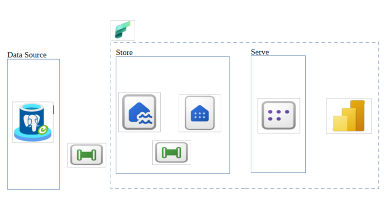

# MS-Fabric-Pipelines

In this project, we start with a simple but realistic scenario. We have an on‑premises PostgreSQL database hosting a Retail schema. 
The schema contains 12 operational tables that represent a typical transactional retail system:
- categories
- orders
- customers
- employees
- etc

The dataset itself originates from a [Kaggle-Retail DWH](https://www.kaggle.com/datasets/datarspectrum/retail-data-warehouse-12-table-1m-rows-dataset) 
All PostgreSQL **CREATE TABLE** statements are available at [here](https://github.com/EMazarakis/MS-Fabric-Pipelines/blob/main/SQL%20Code/001.CREATE_STATEMENTS_POSTGRESQL_TABLES.sql)

Our goal is to take this on‑prem dataset and build a complete end‑to‑end analytics solution using Microsoft Fabric. That means:
- Ingesting data from PostgreSQL
- Storing it inside a Fabric Lakehouse & Warehouse
- Building a semantic model
- Creating a Power BI report on top of it

All of this happens within a single unified platform.  Microsoft Fabric gives us one place, without jumping between disconnected services, to:
1) orchestrate ingestion
2) transformation
3) modeling
4) reporting 

## Goal
Our goal is to build a mechanism that uses parameterized pipelines, supported by a control table and a log table, to orchestrate and manage the execution of all pipeline runs.

